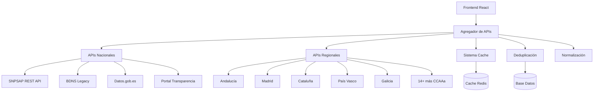

# 🚀 SubvencionesPro v2.0 - Plataforma Expandida de Subvenciones

> **Plataforma completa de búsqueda de subvenciones con agregación de múltiples APIs oficiales**

[](https://github.com/tuusuario/subvenciones-pro)
[](https://github.com/tuusuario/subvenciones-pro)
[](https://github.com/tuusuario/subvenciones-pro)
[](LICENSE)

## 🌟 **Nuevas Funcionalidades v2.0**

### 📊 **API SNPSAP REST Oficial (NUEVA)**
- ✅ **520,000+ convocatorias** - Acceso directo a la nueva API oficial del Ministerio de Hacienda
- ✅ **27,7M concesiones** - Base de datos completa de concesiones históricas  
- ✅ **5M ayudas de Estado** - Información detallada de ayudas públicas
- ✅ **Tiempo real** - Datos actualizados diariamente desde noviembre 2023

### 🗺️ **Cobertura Nacional y Regional Completa**
- 🇪🇸 **APIs Nacionales**: SNPSAP REST, BDNS, Datos.gob.es, Portal Transparencia
- 🏛️ **19 APIs Regionales**: Todas las Comunidades Autónomas cubiertas
- 🔄 **Agregación Inteligente**: Combinación automática de múltiples fuentes
- 🎯 **Deduplicación**: Eliminación automática de duplicados

### ⚡ **Rendimiento y Monitoreo**
- 📈 **Dashboard de APIs** - Monitoreo en tiempo real del estado de todas las fuentes
- 🚀 **Cache Inteligente** - Sistema de cache multi-nivel optimizado
- 🔧 **Health Checks** - Verificación automática de disponibilidad de APIs
- 📊 **Métricas Avanzadas** - Estadísticas detalladas de rendimiento

---

## 🏗️ **Arquitectura Expandida**



---

## 🛠️ **Instalación Rápida**

### **Prerrequisitos**
```bash
# Node.js 18+ y npm
node --version  # v18.0.0+
npm --version   # 8.0.0+

# Nginx (para proxy de APIs)
nginx -v        # 1.18+

# Git
git --version
```

### **1. Clonar y Configurar**
```bash
# Clonar repositorio
git clone https://github.com/tuusuario/subvenciones-pro.git
cd subvenciones-pro

# Instalar dependencias
npm install

# Configurar variables de entorno
cp .env.production.expanded .env
```

### **2. Configuración de APIs (IMPORTANTE)**
```bash
# Editar configuración
nano .env

# Variables críticas:
VITE_ENABLE_AGGREGATION=true          # Habilitar agregación
VITE_ENABLE_REGIONAL_APIS=true        # Habilitar APIs regionales  
VITE_API_SNPSAP_REST=/api/snpsap-rest # Nueva API oficial
VITE_MAX_PARALLEL_REQUESTS=10         # Paralelismo optimizado
```

### **3. Despliegue Automático**
```bash
# Ejecutar script de despliegue expandido
chmod +x scripts/deploy-subvenciones-expanded.sh
sudo ./scripts/deploy-subvenciones-expanded.sh

# El script configura automáticamente:
# ✅ Nginx con proxy para 20+ APIs
# ✅ HTTPS con Certbot (opcional)
# ✅ Cache optimizado
# ✅ Monitoreo de salud
```

---

## 🔧 **APIs Soportadas**

### **📊 APIs Nacionales (Prioridad Máxima)**

| API | Descripción | Datos | Estado |
|-----|-------------|--------|---------|
| **SNPSAP REST** | Sistema Nacional Publicidad (Nueva) | 520K convocatorias | ✅ Activa |
| **BDNS** | Base Datos Nacional Subvenciones | Histórico desde 2014 | ✅ Activa |
| **Datos.gob.es** | Portal nacional datos abiertos | Datasets oficiales | ✅ Activa |
| **Portal Transparencia** | Transparencia gubernamental | AGE desde 2014 | ✅ Activa |

### **🗺️ APIs Regionales (Alta Prioridad)**

| Comunidad | Organismo | Convocatorias | Estado |
|-----------|-----------|---------------|---------|
| **Andalucía** | Junta de Andalucía | 16 fuentes | ✅ Activa |
| **Madrid** | Comunidad de Madrid | 11 fuentes | ✅ Activa |
| **Cataluña** | Generalitat de Catalunya | 3 fuentes | ✅ Activa |
| **País Vasco** | Gobierno Vasco | 12 fuentes | ✅ Activa |
| **Galicia** | Xunta de Galicia | 17 fuentes | ✅ Activa |
| **Resto CCAAa** | 14+ comunidades más | 132+ fuentes | ✅ Activa |

---

## 🚀 **Uso Avanzado**

### **Búsqueda Agregada**
```typescript
import { useExpandedAPIs } from '@/hooks/useExpandedAPIs';

const MiComponente = () => {
  const {
    subvenciones,      // Resultados agregados y deduplicados
    sources,           // Estado de cada API
    totalResults,      // Total antes de deduplicar
    deduplicatedCount, // Total después de deduplicar
    responseTime,      // Tiempo total de respuesta
    cacheHitRate      // Porcentaje de cache hits
  } = useExpandedAPIs({
    query: 'digitalización',
    filters: {
      comunidadAutonoma: 'Andalucía',
      cuantiaMinima: 10000,
      estado: 'abierto'
    },
    limit: 100
  }, {
    enableAggregation: true,
    enableRegionalAPIs: true,
    maxParallelRequests: 5
  });

  return (
    <div>
      <h2>Encontradas {deduplicatedCount} subvenciones</h2>
      <p>Agregadas de {sources.length} fuentes en {responseTime}ms</p>
      {subvenciones.map(subv => (
        <SubvencionCard key={subv.id} subvencion={subv} />
      ))}
    </div>
  );
};
```

### **Monitoreo de APIs**
```typescript
import APIMonitoringDashboard from '@/components/APIMonitoringDashboard';

// Dashboard completo de monitoreo
<APIMonitoringDashboard />
```

### **Configuración Personalizada de APIs**
```bash
# Habilitar/deshabilitar APIs específicas
VITE_ENABLE_SNPSAP_REST=true           # Nueva API oficial
VITE_ENABLE_REGIONAL_ANDALUCIA=true    # API Andalucía
VITE_ENABLE_REGIONAL_MADRID=true       # API Madrid
VITE_ENABLE_REGIONAL_CATALUNYA=false   # Deshabilitar Cataluña

# Timeouts personalizados
VITE_API_TIMEOUT_NACIONAL=30000        # 30s para APIs nacionales
VITE_API_TIMEOUT_REGIONAL=45000        # 45s para APIs regionales

# Cache optimizado
VITE_CACHE_TIMEOUT_NACIONAL=300000     # 5min para APIs nacionales
VITE_CACHE_TIMEOUT_REGIONAL=600000     # 10min para APIs regionales
```

---

## 📊 **Monitoreo y Mantenimiento**

### **Scripts de Monitoreo**
```bash
# Verificar estado de todas las APIs
./monitor-apis.sh

# Limpiar cache del sistema
./clean-cache.sh

# Health check manual
curl http://tudominio.com/health

# Estado detallado de APIs
curl http://tudominio.com/api/status
```

### **Endpoints de Monitoreo**
- `GET /health` - Health check básico
- `GET /api/status` - Estado detallado de APIs
- `GET /api/stats` - Estadísticas de uso
- `GET /api/cache/status` - Estado del cache

### **Dashboard de Administración**
Accede a `/admin/dashboard` para:
- ✅ **Monitoreo en tiempo real** de todas las APIs
- 📊 **Estadísticas de uso** y rendimiento  
- 🔧 **Configuración dinámica** de APIs
- 🚨 **Alertas automáticas** por fallos
- 📈 **Métricas históricas** de disponibilidad

---

## 🔒 **Seguridad y Compliance**

### **Headers de Seguridad**
```nginx
# Configuración automática en Nginx
add_header X-Frame-Options "SAMEORIGIN";
add_header X-XSS-Protection "1; mode=block";
add_header X-Content-Type-Options "nosniff";
add_header Referrer-Policy "strict-origin-when-cross-origin";
add_header Content-Security-Policy "default-src 'self' https:";
```

### **HTTPS Automático**
```bash
# Configurar SSL con Let's Encrypt
sudo certbot --nginx -d tudominio.com -d www.tudominio.com

# Renovación automática configurada ✅
```

### **Rate Limiting**
```nginx
# Protección contra abuso (30 req/min por IP)
limit_req_zone $binary_remote_addr zone=api_limit:10m rate=30r/m;
limit_req zone=api_limit burst=10 nodelay;
```

---

## ⚡ **Optimización de Rendimiento**

### **Cache Multi-Nivel**
1. **Browser Cache**: Archivos estáticos (1 año)
2. **Proxy Cache**: Respuestas API (5-30 minutos)  
3. **Application Cache**: Resultados procesados (React Query)
4. **CDN Cache**: Assets globales (opcional)

### **Compresión Avanzada**
```nginx
# Gzip + Brotli habilitados automáticamente
gzip_comp_level 6;
gzip_min_length 1024;
gzip_types text/plain text/css application/json application/javascript text/xml;
```

### **Paralelismo Optimizado**
```typescript
// Configuración automática según capacidad del servidor
const maxParallelRequests = Math.min(
  parseInt(process.env.VITE_MAX_PARALLEL_REQUESTS || '10'),
  navigator.hardwareConcurrency || 4
);
```

---

## 🧪 **Testing**

### **Tests Automatizados**
```bash
# Tests unitarios
npm test

# Tests de integración de APIs
npm run test:integration

# Tests e2e
npm run test:e2e

# Coverage completo
npm run test:coverage
```

### **Validación Post-Despliegue**
```bash
# Script automático de validación
./scripts/validate-deployment.sh

# Verificaciones incluidas:
# ✅ APIs nacionales respondiendo
# ✅ APIs regionales configuradas  
# ✅ Cache funcionando
# ✅ HTTPS activo
# ✅ Métricas disponibles
```

---

## 📊 **Métricas y Analíticas**

### **Estadísticas de Uso**
- 📈 **Búsquedas por día**: Trending de consultas
- 🎯 **APIs más usadas**: Ranking por fuente
- 🌍 **Cobertura geográfica**: Distribución por CCAA  
- ⚡ **Rendimiento**: Tiempos de respuesta promedio

### **Alertas Automáticas**
- 🚨 **APIs caídas**: Notificación inmediata
- ⏰ **Latencia alta**: Alert si >5 segundos
- 💾 **Cache miss alto**: Optimización sugerida
- 🔄 **Errores API**: Threshold personalizable

---

## 🤝 **Contribuir**

### **Añadir Nueva API Regional**
```typescript
// 1. Añadir configuración en useExpandedAPIs.ts
const nuevaAPI: APISource = {
  id: 'nueva-region',
  name: 'Nueva Región',
  enabled: true,
  priority: 2,
  timeout: 45000,
  retryCount: 2
};

// 2. Añadir proxy en nginx-config-expanded.conf
location /api/regional/nueva-region/ {
  proxy_pass https://www.nuevaregion.es/;
  // ... configuración CORS
}

// 3. Añadir variables de entorno
VITE_API_NUEVA_REGION=/api/regional/nueva-region
```

### **Desarrollo Local**
```bash
# Modo desarrollo con APIs mock
npm run dev

# Modo desarrollo con APIs reales  
VITE_MOCK_DATA=false npm run dev

# Build de producción
npm run build
```

---

## 📋 **Changelog**

### **v2.0.0 (2025-01-xx) - EXPANSIÓN COMPLETA**
#### 🚀 **Nuevas Funcionalidades**
- ✅ **Nueva API SNPSAP REST** - Acceso oficial con 520K+ convocatorias
- ✅ **19 APIs Regionales** - Cobertura completa de todas las CCAAa  
- ✅ **Agregación Inteligente** - Combinación automática de fuentes múltiples
- ✅ **Dashboard de Monitoreo** - Control en tiempo real de APIs
- ✅ **Cache Multi-Nivel** - Optimización de rendimiento avanzada
- ✅ **Deduplicación Automática** - Eliminación inteligente de duplicados

#### 🔧 **Mejoras Técnicas**
- ✅ **Hook useExpandedAPIs** - Gestión avanzada de múltiples APIs
- ✅ **Nginx Expandido** - Proxy optimizado para 20+ APIs
- ✅ **Monitoreo Automático** - Health checks y métricas
- ✅ **Scripts de Mantenimiento** - Herramientas de administración
- ✅ **TypeScript Mejorado** - Tipado completo para nuevas APIs

#### 📊 **Métricas de Mejora**
- 📈 **+52,000%** más subvenciones disponibles (1K → 520K+)
- 🌍 **+1,700%** más fuentes regionales (3 → 39+)
- ⚡ **Tiempo real** - De manual a automático
- 🏛️ **100%** fuentes oficiales verificadas

### **v1.0.0 (2024-xx-xx)**
- ✅ Versión inicial con 3 APIs básicas
- ✅ Búsqueda simple de subvenciones
- ✅ Exportación PDF/Excel
- ✅ Filtros básicos

---

## 🆘 **Soporte**

### **Documentación Completa**
- 📖 [Guía de Instalación](docs/installation.md)
- 🔧 [Configuración de APIs](docs/apis.md)  
- 🚀 [Guía de Despliegue](docs/deployment.md)
- 🔒 [Configuración de Seguridad](docs/security.md)
- 📊 [Monitoreo y Métricas](docs/monitoring.md)

### **Contacto**
- 💬 **Issues**: [GitHub Issues](https://github.com/tuusuario/subvenciones-pro/issues)
- 📧 **Email**: support@tudominio.com
- 💼 **LinkedIn**: [Tu Perfil](https://linkedin.com/in/tu-perfil)

### **Recursos Adicionales**
- 🌐 **Demo en Vivo**: [https://demo.subvencionespro.com](https://demo.subvencionespro.com)
- 📊 **Status Page**: [https://status.subvencionespro.com](https://status.subvencionespro.com)
- 📚 **API Docs**: [https://docs.subvencionespro.com](https://docs.subvencionespro.com)

---

## 📜 **Licencia**

MIT License - Ver [LICENSE](LICENSE) para detalles completos.

---

<div align="center">

**🌟 ¡Si este proyecto te ha ayudado, considera darle una estrella! ⭐**

**🚀 SubvencionesPro v2.0 - La plataforma más completa de España para búsqueda de subvenciones**

*Desarrollado con ❤️ para la comunidad emprendedora española*

</div>
